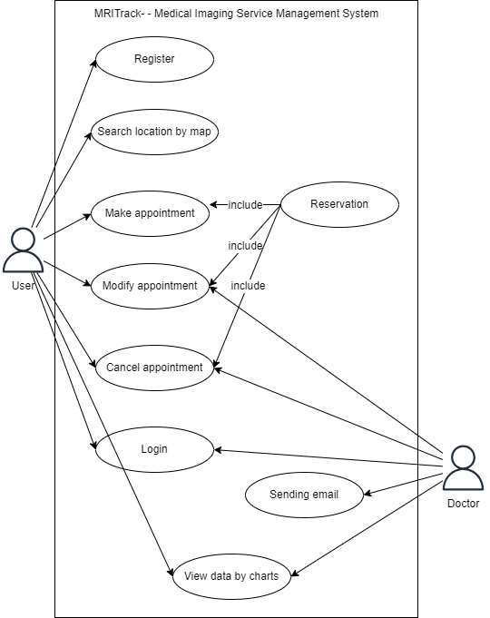
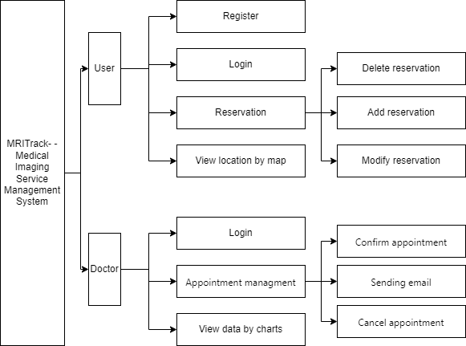
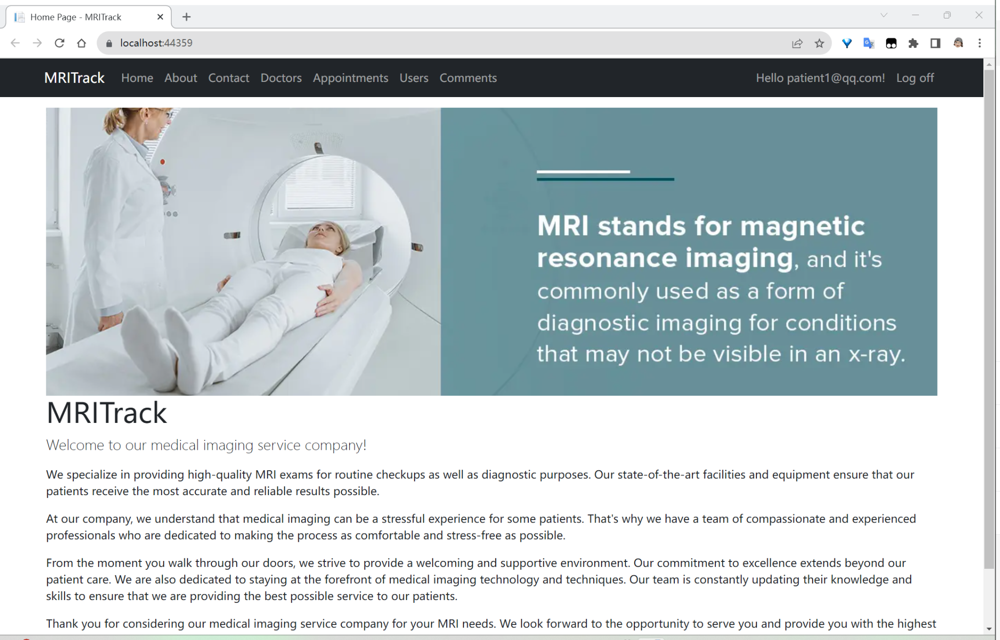
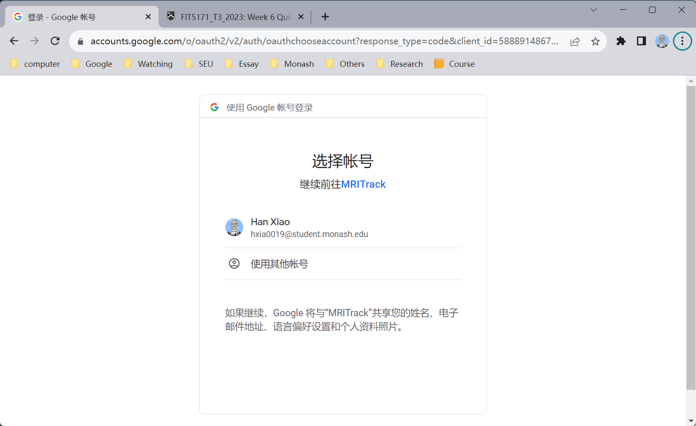
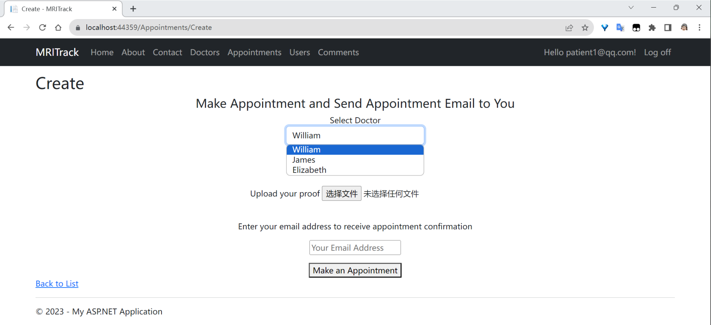
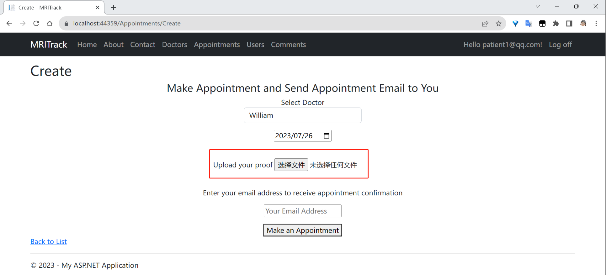
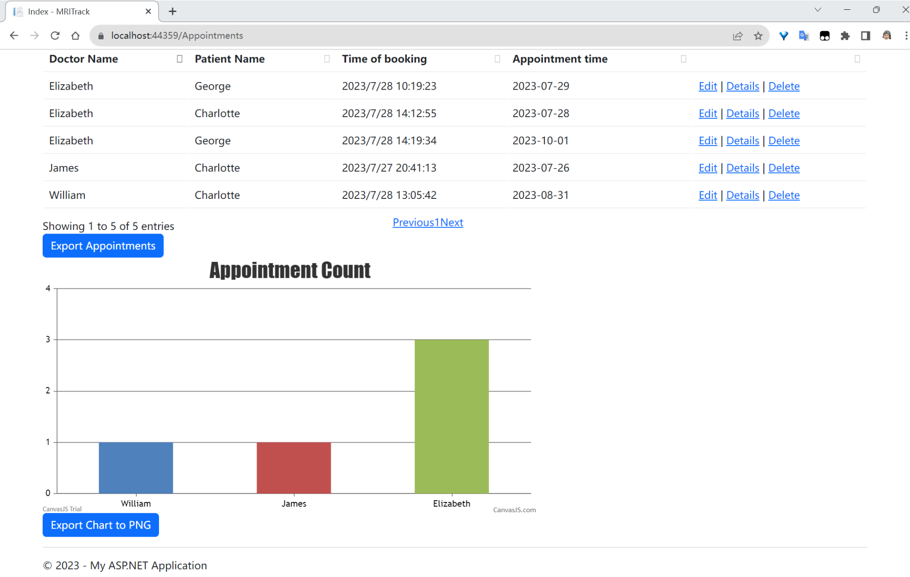
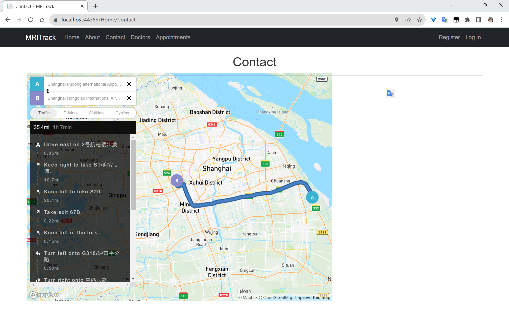

# MRITrack

## Description: 
MRITrack is a web application based on C#, ASP.NET,MVC and MS SQL database, designed to help medical imaging service companies manage their MRI business. Through MRITrack, users can schedule MRI checkups and choose their preferred doctor after registering and logging in. Additionally, they can view the nearest medical imaging testing institution owned by the company on a map.
In the system, doctors can confirm user bookings. The booking results will be provided to the user through the system or as an attachment in an email. Doctors can also view statistical charts of appointment data within the system.

## User stories and Use case diagram 

### 2.1 User Role: Doctor
Goals: Log in to the MRITrack application to access and manage personal information and work tasks.
Details:
Logging in: The doctor wants the capability to log in to the MRITrack application to access and manage their personal information and work tasks.
Accessing profile page: After logging in, the doctor expects to be able to access their profile page to view and edit their personal information, such as name and contact information.
Managing scheduled MRI appointments: The doctor wants the ability to check or cancel a user's appointment for scheduled MRI exams. This functionality allows them to make adjustments to their work schedule as needed.
Viewing statistical charts: The doctor desires the capability to view statistical charts within the system. These charts provide insights into appointment data. By analyzing this data, the doctor can make informed decisions and plans.

### 2.2 User Role: User
Goal: To register and log in to the MRITrack app to be able to book MRI exams and select preferred doctors.
Details:
Registering an account: The User wants the capability to register a new account with their email address or a third-party email address to access the MRITrack application.
Logging in: Once registered, the User expects to be able to log in to the MRITrack application using the provided registration credentials.
Viewing available MRI health check-up times and dates: As a user, they desire the ability to see the available MRI health check-up times and dates, allowing them to schedule an appointment that suits their needs.
Selecting a preferred doctor: The User wants the option to choose their preferred doctor for the MRI health check-up, ensuring they receive services from a trusted doctor.
Receiving appointment confirmation: After selecting a suitable appointment time and doctor for the MRI health check-up, the User expects to receive a confirmation email for the appointment. This confirmation will help them prepare and arrive at the medical imaging testing facility on time.
Accessing a map of medical imaging test facilities: The User would appreciate having access to a map within the MRITrack app that displays the locations of medical imaging test facilities. This visual representation will make it easier for them to choose the most suitable facility.

### Block/Functional diagram 

### Class Diagram or Entity Relation Diagram 

### Data dictionary 
**Table: Doctors**

| Column   | Data Type   | Description          |
|----------|-------------|----------------------|
| Id       | int (PK)    | Doctor's ID          |
| FirstName| nvarchar(max) | Doctor's first name |
| LastName | nvarchar(max) | Doctor's last name  |

**Table: Appointments**

| Column     | Data Type   | Description          |
|------------|-------------|----------------------|
| Id         | int (PK)    | Appointment ID       |
| Date       | datetime    | Appointment date     |
| Time       | nvarchar(max) | Appointment time   |
| UserId     | int         | User ID              |
| DoctorId   | int         | Doctor ID            |

**Table: Users**

| Column     | Data Type   | Description          |
|------------|-------------|----------------------|
| Id         | int (PK)    | User ID              |
| FirstName  | nvarchar(max) | User's first name   |
| LastName   | nvarchar(max) | User's last name    |

**Table: Comments**

| Column       | Data Type  | Description        |
|--------------|------------|--------------------|
| Id           | int (PK)   | Comment ID         |
| Star         | smallint   | Comment rating     |
| AppointmentId| int        | Appointment ID     |
| DoctorId     | nvarchar(max) | Doctor ID         |

### Screenshot

